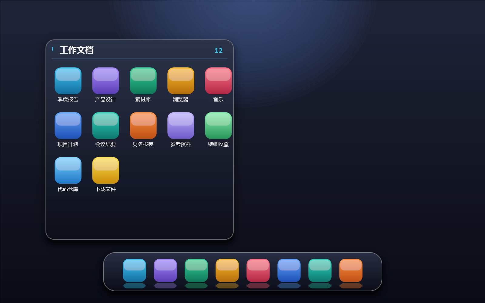

# WinFence

**[简体中文](README.md) | [English](README.en.md)**

**Windows 10/11 桌面图标栅栏（Fences）+ macOS 式 Dock 的开源桌面整理工具。**



*上图：WinFence 效果示意图（栅栏容器 + Dock 栏；实际效果以真机运行为准）*

---

开源的 Windows 10/11 桌面图标栅栏（Fences）+ macOS 式 Dock 栏——把桌面图标分组收纳进可拖拽、可缩放、可折叠的亚克力毛玻璃圆角容器（Apple 质感：柔和投影 + 发丝描边 + 玻璃高光），或在屏幕底部 Dock 中抛物线放大、单击启动。**不移动你的任何真实文件**。

  

**[⬇ 下载 v0.1.1](https://github.com/SearchT-zy/WinFence/releases/latest)**（绿色版 zip，解压即用，无依赖）

## 功能特性

### 栅栏容器（Fences）
- ✅ **Apple 级材质（双层窗口）**：Win11 亚克力毛玻璃 + 独立阴影窗渲染双层柔和高斯投影，
  玻璃与投影并存、无模糊光晕；发丝描边 + 顶部内高光 + 玻璃高光
- ✅ 亚克力毛玻璃（Win11 `DWMSBT`，旧系统自动回退），桌面图标之上、应用窗口之下
- ✅ 拖动 / **八方向缩放** / 双击折叠（150ms 动画 + 折叠 chevron）/ 内容区滚动 + 发光滑动条
- ✅ 悬停图标发光高亮（accent 描边 + 轻微放大）；标题栏「**＋**」一键新建栅栏（悬停反馈）
- ✅ 右键重命名（内联编辑）；悬停高亮
- ✅ 全局热键 **Ctrl+Alt+N** 新建（被占用自动切换 Ctrl+Alt+Shift+N）
- ✅ 从桌面/资源管理器拖入收纳（虚拟归属）；栅栏互拖、栏内拖动排序
- ✅ 图标双击打开、右键移除；256px 高清图标（`SHIL_JUMBO`），中文文件名完整支持

### Dock 栏（macOS 式）
- ✅ 屏幕底部黑色半透明圆角条（柔和投影 + 玻璃高光，常驻顶层）
- ✅ **抛物线悬停放大**（与鼠标距离高斯衰减、邻图标联动）+ accent 光晕
- ✅ **squircle 圆角图标遮罩**（中心裁剪 + 玻璃反光 + 发丝描边）+ 图标倒影
- ✅ 单击启动；名称气泡（发丝描边 + 尾角）；与栅栏双向拖拽、栏内排序、右键移除/隐藏

### AI 智能分组
- ✅ 双后端：**DeepSeek 云端**（API Key 经 DPAPI 加密存储）/ **Ollama 本地**（数据不出机器）
- ✅ **仅手动触发**（设置面板「AI 整理」按钮），无任何自动执行
- ✅ 隐私：只上传文件名/扩展名/类型，**不含路径、不读文件内容**
- ✅ 严格 JSON 校验：模型幻觉（未知 uid）/ 跨组重复 → 整体作废，绝不部分应用
- ✅ 生成后先**预览确认**再应用；应用前自动备份，**一键重置**

### 系统集成
- ✅ 布局 JSON 持久化（原子写 + `.bak` 轮换，显示器归一化坐标，多 DPI/多显示器安全）
- ✅ 桌面文件实时同步：新增/删除/重命名自动对账（重命名归属迁移、orphan 7 天保留）
- ✅ **D2D 自绘设置面板**（柔和投影 + 实时预览卡 / 强调色预设 / 渐变按钮 / 发光滑条 / 带投影开关，实时生效）+ 托盘菜单
- ✅ 隐藏桌面图标（干净桌面）、开机自启

### 安全设计（为什么不"动"你的文件）

WinFence **不注入、不 Hook Explorer**，只使用 Windows 公开 API（CI 设有高危 API 禁词审查）；
图标归属关系只保存在 WinFence 自己的 JSON 配置里，代码中不存在删除/移动桌面文件的调用。
详见[设计文档](docs/DESIGN.md)。

## 构建与运行

要求：Visual Studio 2022 + Windows 10 SDK (10.0.22621+) + CMake ≥ 3.24。

```powershell
cmake -B build -G "Visual Studio 17 2022" -A x64
cmake --build build --config Release
# 产物：build\Release\WinFence.exe（静态 CRT，绿色单文件）
```

或直接从 [Releases](https://github.com/SearchT-zy/WinFence/releases/latest) 下载。

## 文档

- [docs/DESIGN.md](docs/DESIGN.md) — 完整设计：架构 / 数据结构 / 核心流程 / Windows 坑点清单（中文）
- [docs/CREDITS.md](docs/CREDITS.md) — 参考项目与许可证纪律

## License

MIT — 见 [LICENSE](LICENSE)。第三方依赖（nlohmann/json，MIT）与参考项目见
[docs/CREDITS.md](docs/CREDITS.md)。
